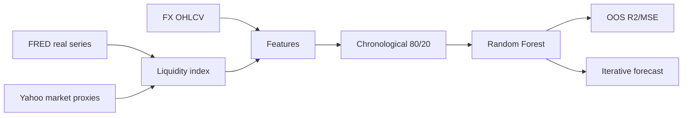

# 🌊 Global Liquidity Dataminer — verified research dossier

> **Статус:** 🔬 R&D macro/FX data-mining prototype.
> **Проверено по фактическому Python source:** 29.09.2026.
> **Ключевой finding:** several “central-bank balance sheet” series are **FX-price proxies**, not actual central-bank balance-sheet data.

## 1. 🎯 Задача

Repository объединяет macro/liquidity proxies и MT5 FX data, строит composite liquidity index и RandomForest forecast prototype.

Цель разумная: проверить, добавляет ли global liquidity information predictive value FX forecasts.

Но source quality зависит от правильной семантики inputs.

## 2. 📦 Фактический состав

```text
global_liquidity_dataminer/
├── global_liquidity_dataminer.py
└── README.md
```

Single Python script (~28 KB) содержит ingestion, index construction, model training, forecasting и visualization.

## 3. 📡 Data sources

Imports/use include:

- MetaTrader5;
- FRED API;
- Yahoo Finance;
- requests;
- pandas/numpy;
- RandomForestRegressor;
- StandardScaler.

### Real FRED series if API key exists

- `WALCL` — Federal Reserve total assets;
- `M2SL` — US M2;
- `BOGMBASE` — US monetary base.

### Market proxies

Source labels several FX-derived series as balance-sheet proxies:

- ECB proxy: `EURGBP=X × 1,000,000`;
- BOJ proxy: `1/USDJPY=X × 10,000,000`;
- PBOC proxy: `USDCNY=X × 1,000,000`.

These are **not actual ECB/BOJ/PBOC balance sheets**. They are scaled FX rates.

This semantic distinction is critical.

## 4. 📊 Other global proxies

Money/liquidity section also uses:

- TLT close as bond-liquidity proxy;
- VIX close as volatility/liquidity-related proxy.

Again:

```text
proxy != underlying monetary stock
```

## 5. 🧮 Composite Global Liquidity Index

Each available series is standardized:

[
z_{i,t}=
rac{x_{i,t}-mu_i}{sigma_i}
]

Then source groups by date and averages normalized values:

[
GLI_t = mean_i(z_{i,t})
]

It also computes:

- MA30;
- MA90;
- regime bins:
  - Very Tight;
  - Tight;
  - Neutral;
  - Loose;
  - Very Loose.

The index is saved to CSV.

## 6. ⚠️ Cross-frequency/date issue

Central-bank/macroeconomic series and daily market proxies can have different calendars/frequencies.

Simple concat/group/date + later joins can create sparse alignment and forward-fill behavior.

A rigorous version needs explicit release-date semantics and point-in-time data to avoid revision/lookahead bias.

## 7. 💱 FX feature preparation

For target symbol, MT5 daily data adds:

- 1d/5d/20d price changes;
- rolling 20 volatility;
- volume SMA;
- next-day target return.

Then joins:

- liquidity index;
- MA30/MA90;
- liquidity change/momentum/trend;
- bank proxy levels/changes;
- money supply levels/changes;
- lagged price change/volatility.

Rows with NaNs are dropped.

## 8. 🤖 Model

Training uses chronological 80/20 split:

```text
first 80% → train
last 20%  → test
```

Scaler is fitted on train only — correct basic leakage discipline.

RandomForest defaults in source:

```text
n_estimators = 200
max_depth = 15
min_samples_split = 5
min_samples_leaf = 2
random_state = 42
```

Metrics saved:

- train/test R²;
- train/test MSE;
- feature importance;
- sample count.

## 9. 🚨 “Confidence” is not calibrated confidence

Forecast code sets:

[
confidence=clamp(testR^2,0,1)
]

This is not probabilistic confidence or prediction interval coverage.

Then chart band uses:

[
price	imes(1pm(1-confidence)	imes0.1)
]

This is a display heuristic, not statistically calibrated uncertainty.

README therefore never calls it formal confidence.

## 10. 🔁 Multi-day forecast limitation

For day 2+ source recursively changes only selected latest feature values, notably close and `price_change_1d`.

Many liquidity/macro features remain static rather than being forecast forward.

Thus 5-day path is an iterative scenario based on partially frozen covariates, not a fully dynamic multi-step macro forecast.

## 11. 🏗️ Architecture



## 12. 🛡️ Claim boundaries

```text
FX proxy != central-bank balance sheet
test R²  != confidence probability
feature importance != causal importance
chronological holdout != full walk-forward
forecast chart != trading profitability
liquidity correlation != causal monetary transmission
```

## 13. 🧪 Required scientific repair

1. replace FX “balance sheet” proxies with actual official ECB/BOJ/PBOC series;
2. preserve release timestamp / vintage;
3. point-in-time macro data;
4. frequency normalization;
5. strict walk-forward;
6. baseline without liquidity features;
7. ablation per liquidity source;
8. calibrated prediction intervals;
9. costs if used for trading;
10. multiple currencies/regimes.

## 14. ⚠️ Additional code risks

- `copy_rates_from(symbol,timeframe,utc_from,days)` uses `days` as count, not necessarily “number of days” semantics;
- forward-fill macro/proxy values needs explicit release logic;
- warnings are globally suppressed for UserWarning;
- no dependency lock/test suite;
- current date is used dynamically, making exact reproduction harder.

## 15. 🛠️ Reproducibility

A rigorous run should pin:

- FRED series/vintage;
- Yahoo download timestamps;
- MT5 broker/history hash;
- start/end dates;
- package versions;
- model params;
- output CSV/JSON hashes.

Current script creates `forex_liquidity_data/` outputs at runtime.

## 16. 🗺️ Repository map

| Path | Role |
|---|---|
| `global_liquidity_dataminer.py` | ingestion/index/model/forecast/viz |
| `README.md` | verified dossier |
| tests | ❌ |
| requirements lock | ❌ |
| saved evidence | not structurally separated |

## 17. 🔗 Место в SYNERGY

Macro/liquidity research producer for:

- MIDAS research;
- market graph/regime models;
- QuantLab validation.

It should provide evidence/features, never trade authorization.

## 18. 📊 Evidence maturity

| Layer | Status |
|---|---|
| FRED integration | ✅ code |
| MT5 integration | ✅ code |
| composite index | ✅ code |
| chronological holdout | ✅ basic |
| actual multi-CB balance sheets | ❌ incomplete |
| point-in-time macro data | ❌ |
| walk-forward | ❌ |
| liquidity incremental-alpha proof | ❌ |
| calibrated forecast confidence | ❌ |

## 19. 🚀 Roadmap

- official central-bank APIs;
- vintage-aware dataset;
- feature provenance;
- baseline/ablation;
- walk-forward;
- probabilistic calibration;
- trading-cost evaluation;
- typed macro feature contract.

## 20. 🛑 Что project НЕ утверждает

- that EURGBP/USDJPY/USDCNY are central-bank balance sheets;
- that test R² is forecast probability;
- that liquidity index causes FX moves;
- that forecast is profitable;
- that current prototype is institutional macro research quality.

---

[🧭 SYNERGY SYSTEM](https://github.com/Shtenco/synergy_system) · [📚 Atlas](https://github.com/Shtenco/synergy_system/blob/main/docs/SYNERGY_REPOSITORY_ATLAS.md)
